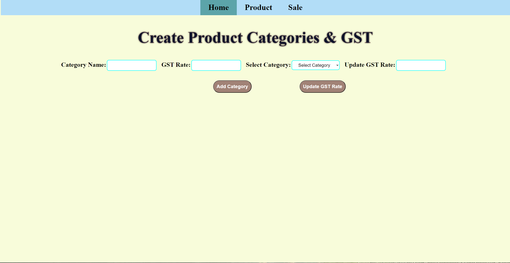
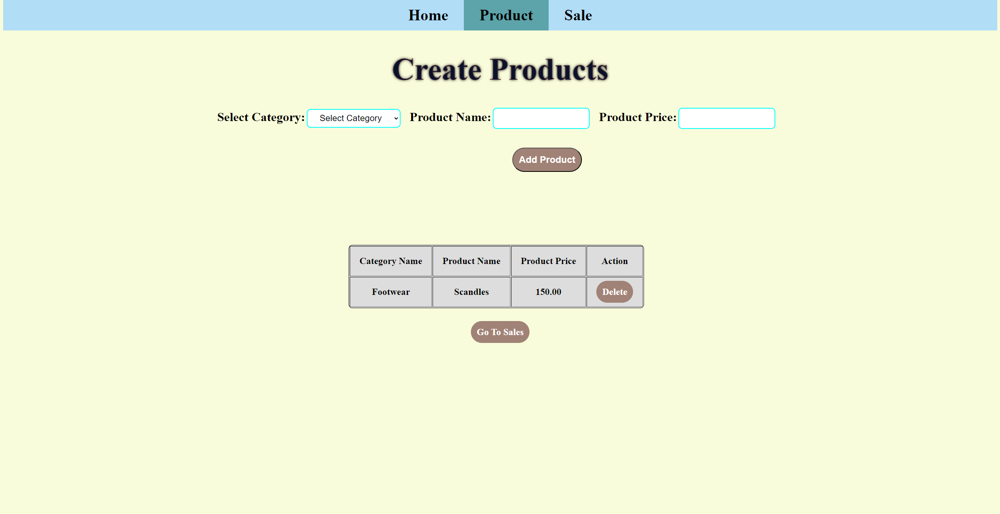
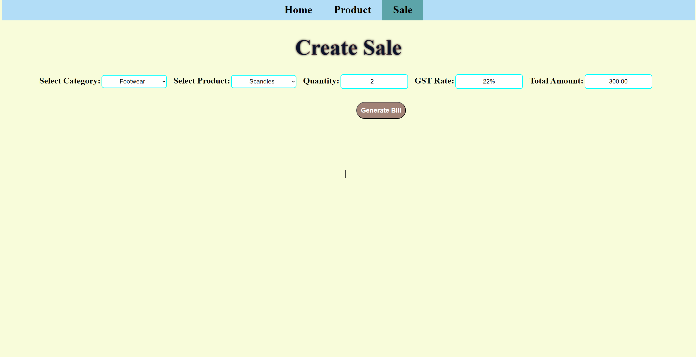
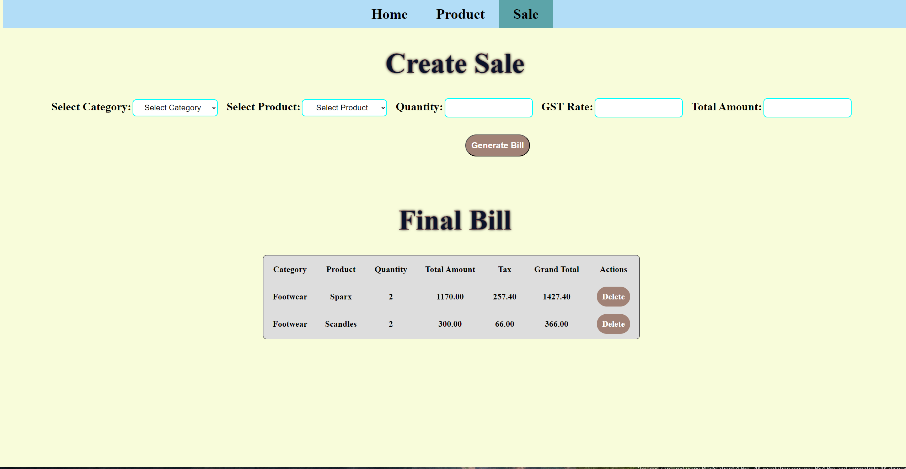

# GST Management System

This repository contains a simple web application for managing Goods and Services Tax (GST). The application allows users to set various GST rates for different product categories, create products within those categories, record sales, and generate bills with calculated taxes.

## Features

1. **Capture GST Rates:**
   - Users can update GST rates for different product categories.

2. **Product Management:**
   - Create products in various categories.
   - Display products and associated GST rates in a table.

3. **Sales Management:**
   - Record product sales, automatically calculating tax rates based on the product category.
   - Generate final bills with detailed tax information.

4. **Clean Code Structure:**
   - The codebase is organized and follows best practices for readability and maintainability.

## Screens

1. **Capture GST Rates:**
   - [index.html](index.html)

2. **Product and Category Management:**
   - [products.html](products.html)

3. **Sales and Billing:**
   - [sales.html](sales.html)

## Screen Shots








## Getting Started

1. Clone the repository:

   ```bash
   git clone https://github.com/Srinidhi-codes/Product_GST_Calculation.git
